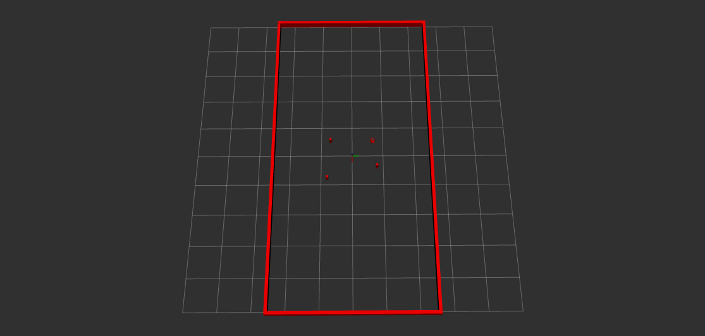

# Nusim

Package for simulation and visualization of a turtlebot. The Nusim node provides a simulated robot environment. The simulator node uses rviz2 for visualization. 

## Launchfiles

- `nusim.launch.py` - launches the nusim node and an rviz visualization.

## Parameters

The launchfile takes a parameter file as an argument. A default file is provided in `config/basic world.yaml`. The parameters that the user can specify are:

-   `x0` - initial location x [m] of the turtlebot
-   `y0` - initial location y [m] of the turtlebot
-   `theta0` - initial location theta [rad] of the turtlebot
-   `arena_x_length` - x length [m] of the arena
-   `arena_y_length` - y length [m] of the arena
-   `obstacles/x` - list of x positions [m] of obstacles
-   `obstacles/y` - list of y positions [m] of obstacles
-   `obstacles/r` - list of radii [m] of obstacles