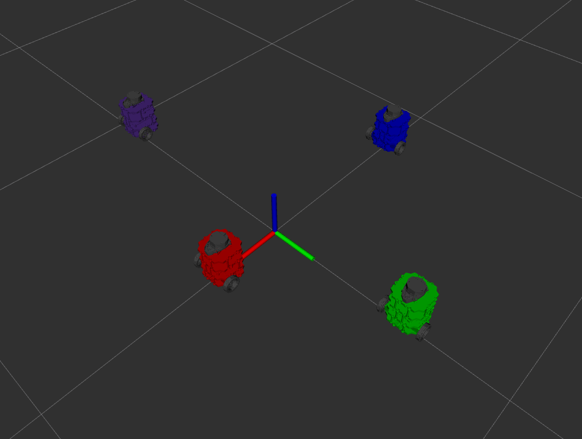

# Nuturtle  Description
URDF files for Nuturtle Beta
* `ros2 launch nuturtle_description load_one.launch.py` to see the robot in rviz.
* `ros2 launch nuturtle_description load_all.launch.py` to see four copies of the robot in rviz.

* The rqt_graph when all four robots are visualized (Nodes Only, Hide Debug) is:

# Launch File Details
* `ros2 launch nuturtle_description load_one.launch.py --show-args`
  `Arguments (pass arguments as '<name>:=<value>'):

    'use_jsp':
        controls whether the joint_state_publisher is used to publish default joint states. Valid choices are: ['true', 'false']
        (default: 'true')

    'use_rviz':
        controls whether rviz is launched. Valid choices are: ['true', 'false']
        (default: 'true')

    'color':
        Determines the color that is passed to the xacro file as an argument. Valid choices are: ['red', 'green', 'blue', 'purple']
        (default: 'purple')`
* `ros2 launch nuturtle_description load_all.launch.py --show-args`
  `Arguments (pass arguments as '<name>:=<value>'):

    'use_jsp':
        controls whether the joint_state_publisher is used to publish default joint states. Valid choices are: ['true', 'false']
        (default: 'true')

    'use_rviz':
        controls whether rviz is launched. Valid choices are: ['true', 'false']
        (default: 'true')

    'color':
        Determines the color that is passed to the xacro file as an argument. Valid choices are: ['red', 'green', 'blue', 'purple']
        (default: 'purple')`